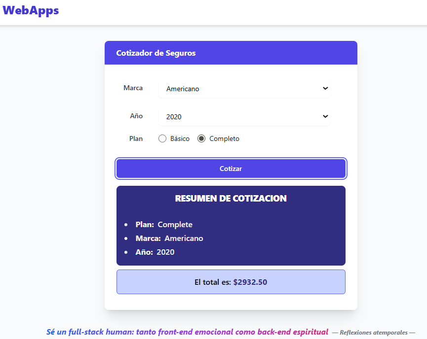

# 🚗 Cotizador de Seguros con React

   

## 📝 Descripción del Proyecto

Este proyecto es una Single-Page Application (SPA) desarrollada con React que ofrece una experiencia de usuario fluida e interactiva para la cotización de seguros de vehículos. La plataforma permite a los usuarios seleccionar la marca, el año y el tipo de plan para obtener un costo estimado al instante, aplicando modificadores de precio basados en las características seleccionadas.

La arquitectura se basa en componentes funcionales y un flujo de datos unidireccional, garantizando un código mantenible y escalable.

## 🖥️ Vista Previa
A continuación, se muestra una captura de pantalla de la interfaz de la aplicación:



## ✨ Características Principales
- **Filtro por Parámetros:** Permite al usuario ajustar la cotización seleccionando la marca, el año del vehículo y el tipo de plan (Básico o Completo).
- **Cálculo Dinámico:** La aplicación calcula el costo total del seguro aplicando una lógica interna de ajuste de precios basada en los datos seleccionados.
- **Validación de Formulario:** Controles para asegurar que todos los campos requeridos sean completados antes de procesar la cotización.
- **Indicador de Carga (Spinner)**: Muestra un spinner durante un breve período para simular el tiempo de procesamiento de la cotización, mejorando la percepción del rendimiento.
- **Arquitectura Basada en Componentes:** Interfaz modularizada con componentes reutilizables y responsabilidades bien definidas (`Card`, `Spinner`, `InsuranceForm`).
- **Animaciones Fluidas:** Integración de `react-transition-group` para presentar los resultados de la cotización con animaciones suaves, mejorando la experiencia de usuario.
- **Diseño Responsivo:** Interfaz adaptable a diferentes tamaños de pantalla gracias al uso de Tailwind CSS.

## 🛠️ Tecnologías Utilizadas

- **Framework:** React 18+
- **Lenguaje:** TypeScript y JSX
- **Bundler:** Vite
- **Estilos:** HTML5, CSS3 & Tailwind CSS.
- **Animaciones:** `react-transition-group`

## ⚙️ Instalación y Configuración

Sigue estos pasos para configurar el entorno de desarrollo local.

1.  **Clonar el repositorio:**
    ```bash
    git clone https://github.com/kevincisnero01/cotizar-seguro-react.git
    ```
2.  **Navega al directorio del proyecto:**
    ```bash
     cd cotizar-seguro-react
    ```
3.  **Instalar dependencias:**
    Este proyecto utiliza `npm` para la gestión de paquetes.
    ```bash
    npm install
    ```

3.  **Ejecutar el proyecto:**
    Inicia el servidor de desarrollo de Vite.
    ```bash
    npm run dev
    ```

4.  **Abrir en el navegador:**
    La aplicación estará disponible en `http://localhost:5173` (o el puerto que indique Vite).

## 📂 Estructura del Proyecto

La estructura del proyecto está organizada para promover la modularidad y la escalabilidad.

```
src/
├── assets/              # Archivos estáticos como imágenes y fuentes
├── components/
│   ├── Insurance/       # Componentes relacionados con el formulario
│   │   └── InsuranceForm.jsx
│   ├── Quotation/       # Componentes para mostrar la cotización
│   │   ├── QuoteResult.jsx
│   │   └── QuoteSummary.jsx
│   ├── common/          # Componentes de UI reutilizables (Card, Spinner, etc.)
│   └── layout/          # Componentes de maquetación (Layout, Header, etc.)
├── helpers/             # Funciones de utilidad puras (cálculos, formato, etc.)
├── App.tsx              # Componente raíz de la aplicación
└── main.tsx             # Punto de entrada de la aplicación
```

## 🛣️ Hoja de Ruta (Roadmap)

El proyecto busca la mejora constante. Estas son las funcionalidades planificadas para el crecimiento del cotizador:

- [x] Cálculo de la Cotización: El sistema calcula el monto final basado en la marca, el año y el plan seleccionado. (Funcionalidad actual)
- [ ] Persistencia del Último Resultado: Almacenar la última cotización en localStorage para que persista al recargar la página.
- [ ] Selección de Coberturas Adicionales: Implementar checkboxes para que el usuario pueda agregar coberturas opcionales (ej. asistencia vial) que afecten el precio final.
- [ ] Validación de Formularios: Agregar validaciones visuales y mensajes de error claros si el usuario no selecciona todos los campos requeridos.
- [ ] Refactorización del Estado: Migrar la lógica de estado a la Context API o a una solución de gestión de estado más avanzada (ej. Redux o Zustand).
- [ ] Mejora de la UI/UX: Refactorizar el diseño utilizando una librería de componentes o un framework CSS (como TailwindCSS) para una estética moderna y responsiva.

---

Este proyecto sirve como una demostración práctica de conceptos fundamentales de React, como la gestión de estado con `useState`, el patrón de "levantamiento del estado" (state lifting), el renderizado condicional y la componentización.
